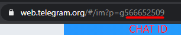

<h1 align="center">
    Requisição de suporte ou limpeza em salas de aula através de QR code
</h1>


<p align="center">
  <a href="#sobre-o-projeto">Sobre o projeto</a>&nbsp;&nbsp;&nbsp;&#149;&nbsp;&nbsp;&nbsp;
  <a href="#funcionamento">Funcionamento</a>&nbsp;&nbsp;&nbsp;&#149;&nbsp;&nbsp;&nbsp;
  <a href="#documentação">Documentação</a>
</p>

# Sobre o projeto

Este projeto tem como finalizade facilitar e agilizar o chamado de suporte ou limpeza em uma sala de aula. Para isso cada sala de aula contará com um QR code próprio em cima da mesa do professor, que ao ser escaniado levará a uma página onde o professor poderá fazer o chamado apenas apertando um botão.

<br>
<p align="center">

</p>
<br>


 Ao efetuar o chamado, uma mensagem será enviada instantaneamente por um BOT ao grupo do telegram da equipe de suporte ou limpeza, essa mensagem vai conter a sala o qual foi feito o chamado.

<br>
<p align="center">

</p>
<br>


# funcionamento

    
 A aplicação é feita em cima de um servidor flask e permite a configuração de quais serão as salas permitidas, podendo adicionar ou remover salas da lista. Também é possível mudar o chat no qual o BOT irá enviar as mensagens de chamado de suporte ou limpeza, isso tudo é feito na página de configuração.

<br>
<p align="center">

</p>
<br>


 A página de configuração exige login, para isso é possivel setar um login padrão no momento de configuração do servidor.


<br>
<p align="center">

</p>
<br>

As credenciais de login vem por padrão como "LOGIN" e "SENHA" e podem ser alteradas na linha 93 do main:

```python
@app.route("/Autenticar", methods=['POST','GET'])
def Autenticar():
    usuario = "LOGIN"
    senha = 'SENHA'
```

As informações de quais salas vão ser liberadas para as requisições, quais os chat id dos grupos no telegram e qual o link da aplicação para que o QR code seja gerado vão ser armazenadas em uma planilha google e acessadas através da API google sheets (Veja na <a href="#documentação">documentação</a> como fazer para utilizar a API).

<br>
<p align="center">

</p>
<br>

Será necessário criar uma planilha e adicionar no código sua key (disponível na url da prórpia planilha):

<br>
<p align="center">

</p>
<br>

Essa key será adicionada na linha 13 do arquivo planilha:

```python
wks = gc.open_by_key('<KEY>')
```
OBS: Caso não queria adicionar uma sala por vez pela pagina de configuração, pode colocar direto na planilha, desde que respete as colunas corretas (a primera coluna é utilizada para armazenamento das salas).

## Fazendo download do QR code

No fim da página de configuração existe  uma lista suspensa com um botão "GERAR". Escolha a sala na lista suspensa e clique em GERAR, o download do QR code será feito automaticamente. 

O QR code é colocado em um background tematico da universidade, ele foi feito a partir de um slide. Caso queria mudar esse fundo, faça um novo em um slide, baixe como uma imagem (jpg) e coloque na pasta qr_code, com o nome "fundo.jpg". Veja po exemplo de como fica o QR code no fundo temático:

<br>
<p align="center">

</p>
<br>

O texto escrito no canto inferior direito é adicionado pela função da criação de QR code, assim sempre sendo o nome da sala escolhida. Caso queira mudar o local em que o QR code ou o nome da sala irá ficar, basta alterar a posição em pixels no arquivo gerador, nas linhas 20 e 21:

```python
draw.text((810, 450),sala,(0,0,0),font=font) #posição do nome da sala
fundo.paste(qr, (330, 120)) #posição do QR code
```

## TELEGRAM
Para a criação do seu BOT, veja o tutorial na <a href="#documentação">documentação</a>. Você deverá colocar o token do seu BOT na linha 11 do main:

```Python
bot = telebot.TeleBot('<TOKEN>') #BOT Token telegram - Token do BOT que irá ser adicionado nos grupos para fazer as chamadas

```

Para que o BOT consiga mandar mensagens no grupo escolhido, adicione seu BOT ao grupo e pegue o CHAT ID desse mesmo grupo. Existem 2 formas de conseguir o CHAT ID de um grupo:

1º Forma:

Adicione o token do seu BOT ao link e coloque o mesmo no navegador. Será retornado uma json contendo várias informações, entre elas o CHAT ID dos grupos que o BOT foi colocado.

```
https://api.telegram.org/bot<YourBOTToken>/getUpdates
```
Procure pelo grupo que adicionou o BOT e então ache o id, que deverá estar dessa forma:
```
"id":1234567
```

2º Forma:

Abra o  <a href="https://web.telegram.org/">WEB telegram</a> e entre no grupo da sua escolha. O CHAT ID deverá estar na URL dessa forma para grupos comuns:

<br>
<p align="center">

</p>
<br>

A letra **g** no inicio da numeração deve ser ignorada. Para super grupos, o link fica diferente e o chat id muda e o número 100 deverá ser adicionado antes do número da URL:

<br>
<p align="center">

</p>
<br>

Deve ser adicionado um **-** na frente desses números para que funcione, porém o servidor já afz isso, então adicione apenas os numeros na página de configuração.

EX:

CHAT ID de um grupo comun: -566652509 <br>
CHAT ID de um super grupo comun: -**100**1444792391


# Documentação

Para utilizar o google planilhas na aplicação, veja esse <a href="https://www.linkedin.com/pulse/manipulando-planilhas-do-google-usando-python-renan-pessoa/?originalSubdomain=pt">tutorial</a>. A aplicação já está com a lógica pronta, é necessário apenas criar as credenciais e pegar a KEY da planilha, o que é ensinado nesse <a href="https://www.linkedin.com/pulse/manipulando-planilhas-do-google-usando-python-renan-pessoa/?originalSubdomain=pt">tutorial</a>.

Para criar um BOT no telegram, veja esse <a href="https://help.huggy.io/telegram-bot/como-configurar-o-telegram-bot">tutorial</a>. Ele vai explicar como criar um BOT a partir do BotFather, que irá fornecer o token do seu BOT, que deverá ser colocado no main, como já explicado anteriormente.


